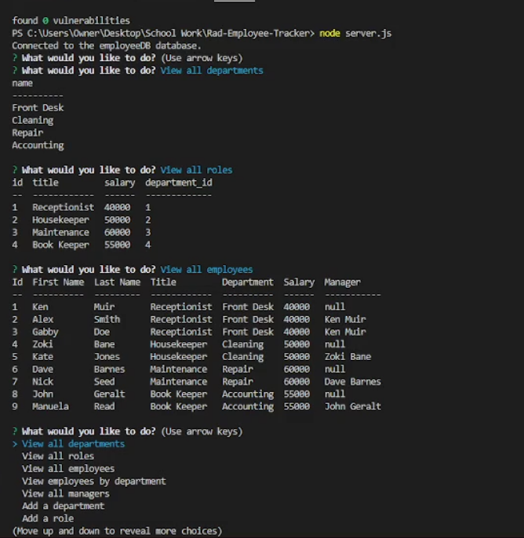

# Rad-Employee-Tracker

  

  ## Description

  This is an Employee Tracker using node.js and SQL! Simply select the option you want to use and answer the questions asked in the terminal and it will adjust your database accordingly.

  ## Table Of Contents

  - [Screenshots](#screenshots)
  - [Installation](#installation)
  - [Usage](#usage)
  - [License](#license)
  - [Guidelines](#guidelines)
  - [Questions](#questions)
  - [Tests](#tests)
  - [Video](#video)

  ## Screenshots

  ## Installation

Type in "mysql -u root -p" and enter your SQL password, make sure to adjust the password code to be your password to connect correctly.
From the Rad-Employee-Generator folder in your terminal, type in source db/schema.sql, then type source db/seed.sql, then type exit.
Type in 'npm i' to install required packages, and finally type in 'node server.js' to run the file, you will now be prompted with a main menu of options.

  ## Usage

  Select from menu options to view, add, and update items in your database
  
## License
    This work is licensed under Creative Commons Attribution 3.0 Unported License.
    https://creativecommons.org/terms#8

  ## Guidelines

  You are open to do with this code as you wish

  ## Questions

  This repo was created by https://github.com/BenBasic
  To contact me, please send an email to Benjamin@TreneonGames.com

  ## Tests
  node server.js will run the program in a terminal window, then select menu items as you wish

  ## Video
https://youtu.be/y3yFcRdOaNg